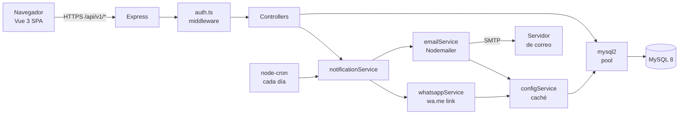

# Architecture — Sistema de Gestión Jurídica

---

## Visión general

API REST en Node.js/TypeScript (Express) que sirve datos de MySQL y, en producción, también sirve el frontend Vue 3 compilado como archivos estáticos. En desarrollo, Vite corre en puerto 5173 con proxy al backend en 3000. La autenticación es JWT. Las configuraciones operativas (SMTP, WhatsApp, alertas) viven en la tabla `configuracion` de la BD y son administradas desde un panel de administración con acceso restringido por rol.

---

## Componentes / módulos

| Módulo | Responsabilidad | Stack |
|---|---|---|
| `src/db/pool.ts` | Pool de conexiones MySQL, reutilizable en toda la app | mysql2/promise |
| `src/config/env.ts` | Valida al arrancar que todas las variables de entorno críticas existen | TypeScript |
| `src/services/configService.ts` | Lee la tabla `configuracion` de BD, cachea en memoria, descifra secretos | Node.js + crypto |
| `src/services/emailService.ts` | Envía correos usando config dinámica de `configService` | Nodemailer |
| `src/services/whatsappService.ts` | Genera link `wa.me` con mensaje formateado usando plantilla configurable | Node.js |
| `src/services/notificationService.ts` | Orquesta email + WhatsApp al crear/actualizar proceso | Node.js |
| `src/jobs/alertasAudiencias.ts` | Cron job diario: consulta procesos con audiencia próxima y notifica | node-cron |
| `src/middleware/auth.ts` | Verifica JWT en cabecera `Authorization: Bearer` | jsonwebtoken |
| `src/middleware/requireAdmin.ts` | Verifica que el payload JWT tenga `rol: admin` | TypeScript |
| `src/middleware/errorHandler.ts` | Captura global de errores — responde JSON limpio, nunca expone stack | Express |
| `src/middleware/validate.ts` | Wrapper de express-validator para endpoints POST/PUT | express-validator |
| `src/controllers/*` | Lógica de negocio por entidad (clientes, procesos, juzgados, auth, admin) | TypeScript |
| `src/routes/v1/*` | Definición de rutas versionadas con middlewares aplicados | Express Router |
| `client/` | SPA Vue 3: login, dashboard, CRUD, panel admin | Vue 3 + Tailwind |

---

## Flujo de datos / control

### Petición autenticada típica

```
Navegador (Vue 3 SPA)
  → axios + header Authorization: Bearer <JWT>
    → Express /api/v1/<recurso>
      → middleware auth.ts (verifica JWT)
        → middleware validate.ts (valida inputs)
          → Controller (async/await)
            → pool.ts → MySQL
              ← ResultSet
            ← JSON response
```

### Notificación al guardar/actualizar proceso

```
Controller procesosController (POST o PUT)
  → notificationService.notificar(proceso)
    → configService.getConfig()         ← lee BD (o caché)
      → emailService.enviar(...)        ← Nodemailer → SMTP externo → correo destinatario
      → whatsappService.generarLink()   ← devuelve URL wa.me con mensaje
    ← { emailEnviado: true, whatsappLink: "https://wa.me/..." }
  ← Response 201/200 con link WhatsApp incluido
```

### Cron job diario de alertas

```
node-cron (cada día a hora configurable)
  → alertasAudiencias.ts
    → pool: SELECT procesos WHERE fecha_audiencia BETWEEN HOY y HOY+N días AND notificado = FALSE
      → forEach proceso:
          → notificationService.notificar(proceso)
          → pool: UPDATE procesos SET notificado = TRUE WHERE id = ?
```

### Diagrama de componentes



---

## Decisiones técnicas

| # | Decisión | Justificación |
|---|---|---|
| 1 | `mysql2/promise` + pool en vez de conexión simple | La conexión simple se corta si MySQL reinicia; el pool se reconecta y soporta async/await nativo |
| 2 | Configuraciones operativas en BD (tabla `configuracion`), no en `.env` | Permite que el admin cambie SMTP, WhatsApp y alertas desde la UI sin acceso al servidor |
| 3 | Cifrado AES-256 de contraseñas SMTP en BD | Las credenciales de correo nunca se almacenan en texto plano, ni siquiera en la BD |
| 4 | Rutas versionadas `/api/v1/` desde el inicio | Cuando haya cambios breaking en Fase B, `/v1` y `/v2` coexisten sin romper el frontend |
| 5 | `client/` separado de `src/` con proxy Vite en dev | Separación limpia frontend/backend; en producción `client/dist/` lo sirve Express como estático |
| 6 | Pinia (no Vuex) para estado global en Vue 3 | Store oficial de Vue 3, más simple, TypeScript nativo, maneja el JWT y el usuario autenticado |
| 7 | `node-cron` embebido en el proceso Node | Suficiente para la escala de un despacho; no requiere Redis ni workers externos |
| 8 | `bcryptjs` para hash de contraseñas | Hash adaptativo resistente a fuerza bruta; factor de costo configurable |
| 9 | Rate limiting en `/auth/login`: máx. 5 intentos / 15 min | Mitiga ataques de fuerza bruta sin necesidad de infraestructura adicional |
| 10 | `requireAdmin` middleware separado de `auth` | Permite aplicar verificación de rol granularmente por ruta sin duplicar lógica |

---

## Integraciones externas

| Sistema | Tipo | Auth | Notas |
|---|---|---|---|
| MySQL 8 | Driver directo | Usuario/contraseña en `.env` | Pool de conexiones, nunca conexión directa |
| Servidor SMTP | SMTP sobre TLS/SSL | Usuario/contraseña cifrados en BD | Configurable desde panel admin |
| WhatsApp | Link `wa.me` | Sin API key (Fase A) | Fase B: Twilio API con credenciales en BD |

---

## Persistencia — estructura clave

```sql
-- Existentes (refactorizadas)
clientes (id, numero_documento, nombre, apellidos, telefono, direccion, ciudad, email, radicado)
juzgados (...)
departamentos (...)
ciudades (...)

-- Ampliada
procesos (
  idproceso, sujetosProcesales, radicado, juzgado, idCliente,
  fecha_audiencia DATE NULL,          ← NUEVO: para alertas automáticas
  estado ENUM('activo','cerrado','suspendido') DEFAULT 'activo',  ← NUEVO
  notificado BOOLEAN DEFAULT FALSE,   ← NUEVO: evita notificaciones duplicadas
  updated_at TIMESTAMP DEFAULT CURRENT_TIMESTAMP ON UPDATE CURRENT_TIMESTAMP  ← NUEVO
)

-- Nuevas
usuarios (
  id, nombre, email, password_hash,
  rol ENUM('admin','abogado') DEFAULT 'abogado',
  activo BOOLEAN DEFAULT TRUE,
  created_at TIMESTAMP DEFAULT CURRENT_TIMESTAMP
)

configuracion (
  id, clave VARCHAR(100) UNIQUE,
  valor TEXT,                         ← cifrado AES-256 si es secreto
  es_secreto BOOLEAN DEFAULT FALSE,
  descripcion VARCHAR(255),
  updated_at TIMESTAMP
)
-- Claves en configuracion:
-- smtp_host, smtp_port, smtp_seguridad, smtp_usuario, smtp_password (secreto)
-- email_from, email_destinatarios
-- whatsapp_numero, whatsapp_plantilla, whatsapp_activo
-- alerta_dias_anticipacion, alerta_hora, alerta_email_activo, alerta_whatsapp_activo
-- despacho_nombre, despacho_direccion, despacho_telefono, despacho_logo_url
```

---

## Trazabilidad y observabilidad

- **Logs:** `console.error` en errores de BD/servicios. En producción: PM2 captura stdout/stderr a archivos rotativos.
- **Errores:** `errorHandler.ts` global — responde `{ error: "mensaje amigable" }` al cliente. El stack trace solo va a logs del servidor, nunca al cliente.
- **Notificaciones fallidas:** si `emailService` falla, se loguea el error pero no se cancela la operación principal (el proceso se guarda igual). El usuario recibe advertencia en la respuesta.
- **Cron job:** loguea cada ejecución con timestamp y número de procesos notificados.

---

## Riesgos identificados

1. **Gmail bloquea SMTP con muchos envíos** → En producción migrar a SendGrid o Brevo (cuenta gratuita). El `emailService` es agnóstico al proveedor.
2. **Cron job se detiene si el servidor se reinicia** → En producción usar PM2 con `--restart-delay` y verificar que el cron se reinicia en el hook `pm2 startup`.
3. **Caché de `configService` queda obsoleta** → El admin, al guardar nueva config, invalida el caché explícitamente. TTL máximo: 5 minutos como fallback.
4. **WhatsApp link (Fase A) requiere acción manual del abogado** → Aceptado como limitación de Fase A. Fase B integra Twilio para envío automático.
